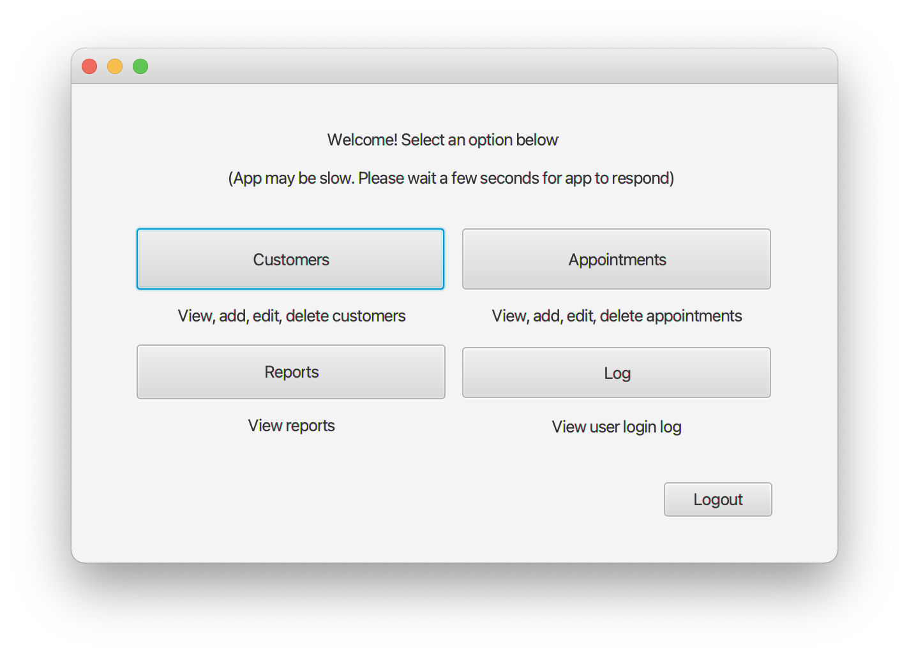
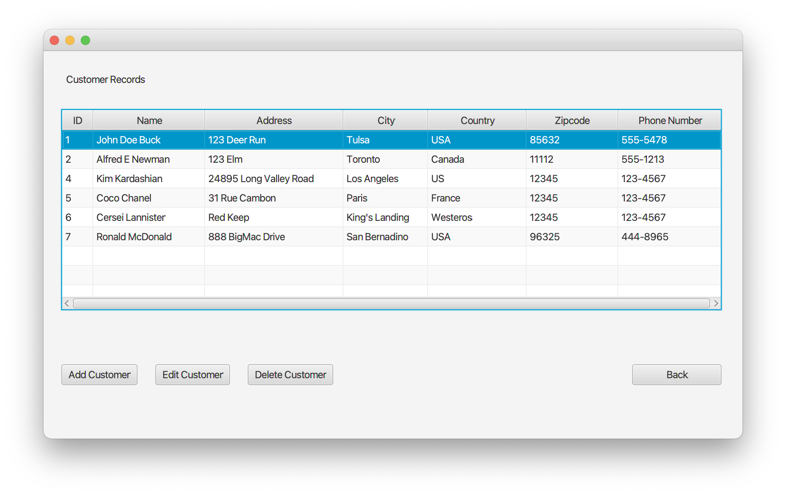
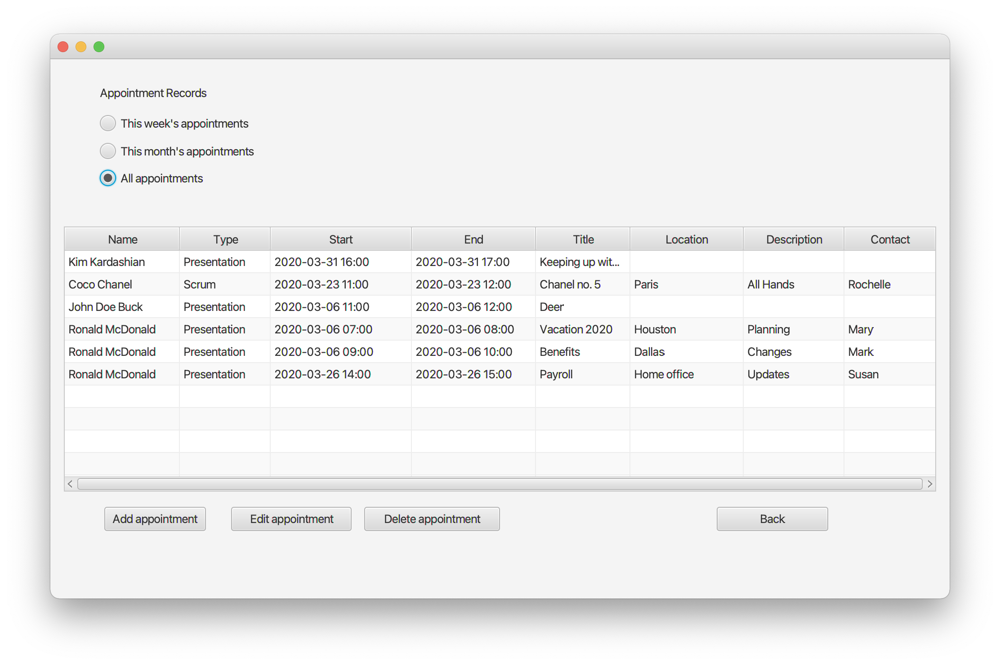

# Appointment Scheduler

## Description

This is a CRUD (Create Read Update Delete) JavaFX desktop application that can schedule appointments for customers. It was created in Netbeans 8 with JDK 8. Scene Builder 8 was used to create the GUI. It uses the Java Database Connectivity (JDBC) API to connect to a MySQL database. 

## Tech Stack

- Java
- JavaFX
- FXML
- MySQL
## Features

- View, add, edit, and delete customers and customer information
- View all appointments, or filter by upcoming week or month
- Add, edit, and delete appointments
- Exception handling to prevent appointments outside of business hours or overlapping appointments
- Alert at login if there is an appointment within 15 minutes
- Additional database views such as schedules for each consultant 
- Times are automatically displayed in user's time zone 
- Automatic language selection - application switches to Korean if the operating system's locale setting is Korean
- A activity log that records user logins

## Demo







<!-- ## Lessons Learned -->

<!-- ## To do -->

## Setup

Install Java Development Kit (JDK) 8 and NetBeans IDE 8<br />
https://www.oracle.com/technetwork/java/javase/downloads/jdk-netbeans-jsp-3413139-esa.html


Open NetBeans. If you have multiple JDKs installed, set Netbeans' JDK to JDK 8. If asked, choose JDK 8 as your platform. <br/>
Or edit `netbeans.conf` file:
```
netbeans_jdkhome="/Library/Java/JavaVirtualMachines/jdk1.8.0_231.jdk/Contents/Home"
```

To install the MySQL JDBC driver, 
1. Right click the coffee cup icon for your project in the projects window. 
2. Choose properties
3. Choose libraries from the left list
4. Click add Library
5. Choose MySQL JDBC Driver


Then go to `Scheduler > src > Scheduler.java`

Press the green arrow button in the menu bar to compile and run Java application. 

Sign in with username `test` and password `test`. 

